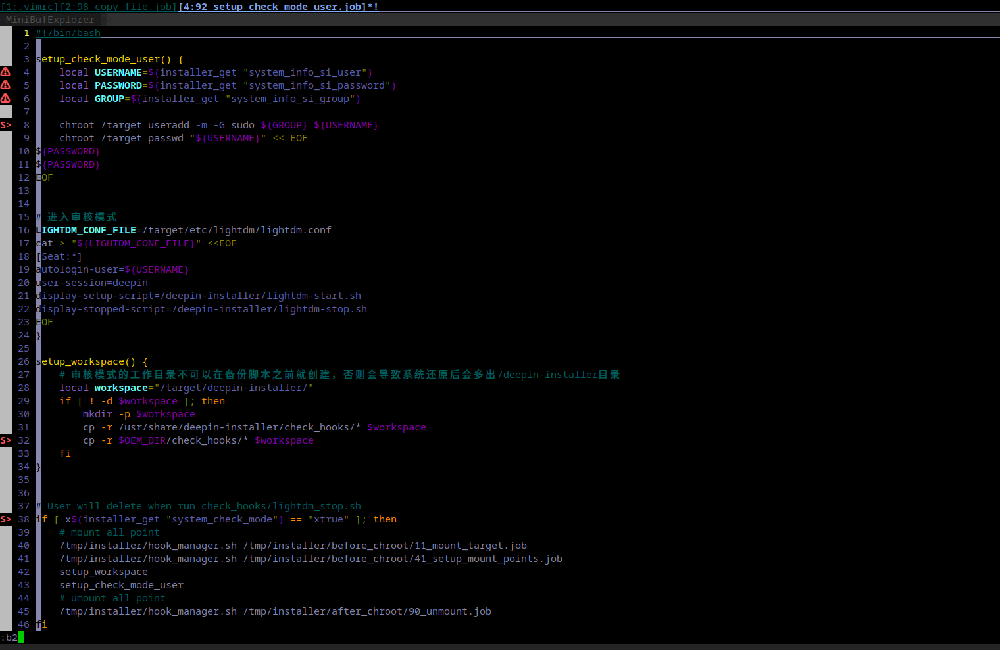

# vim插件使用和说明

开箱即用的vim插件和配置

对应gitee地址是:

## 安装

1, 直接clone代码到home/user目录下

2, 将go-bin下的文件复制到$GOBIN, 建议复制到go安装目录的bin下,主要是vim-go插件所需要的包

3, 执行install.sh脚本,只是针对debian系列的Linux操作系统,其他系统根据自己选择

4, 是否删除go-bin文件加,看自己选择

## 说明

.vimrc主要是vim的相关配置

.vimrc.bundle主要是插件配置

如果想全局配置可以将.vimrc复制到/etc/vimrc中

## 使用

快捷键介绍

F2: 显示或者隐藏行号

F3: 自动换行开关

F4: 左边显示类,变量和函数,可以通过选择快速跳转到相应的地方

F6: 语法开关

F8: 模糊搜索, Ack插件的快捷键.

F9: 生成各类tag,方便各个函数之间跳动

水平分屏:  按住Ctrl键, 再按一下小写的w, 不要松开Ctrl键, 再按一下s

竖直分屏: 按住Ctrl键, 再按一下小写的w, 不要松开Ctrl键, 再按一下h

分屏切换: ctrl+h/j/k/l 左/下/上/右分屏

ctrl+]: 在生产tag后, 可以跳转到方法定义的地方

*: 搜索快捷键,将光标移动到要搜索的单词上,按 * 进行本文件中搜索

%: 匹配括号

:b 2   各个title之间切换

命令:b2,可以将窗口切换到98_copy_file.job中

同时也可以使用分屏切换快捷键将控制区切换到title上选择对应的title

:e filepath打开文件

如果您有更好的意见,请联系我的QQ邮件